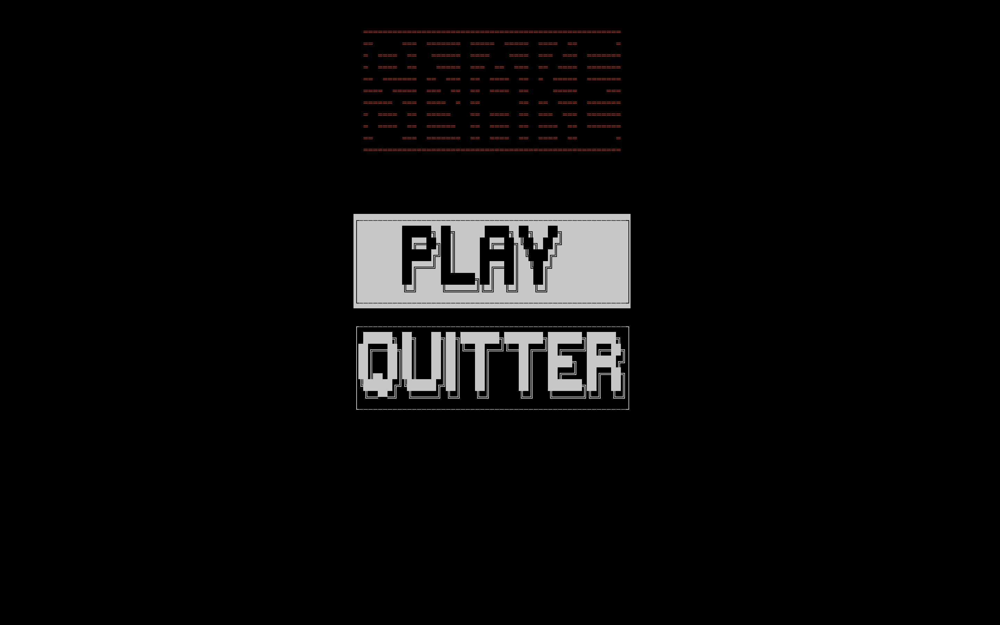
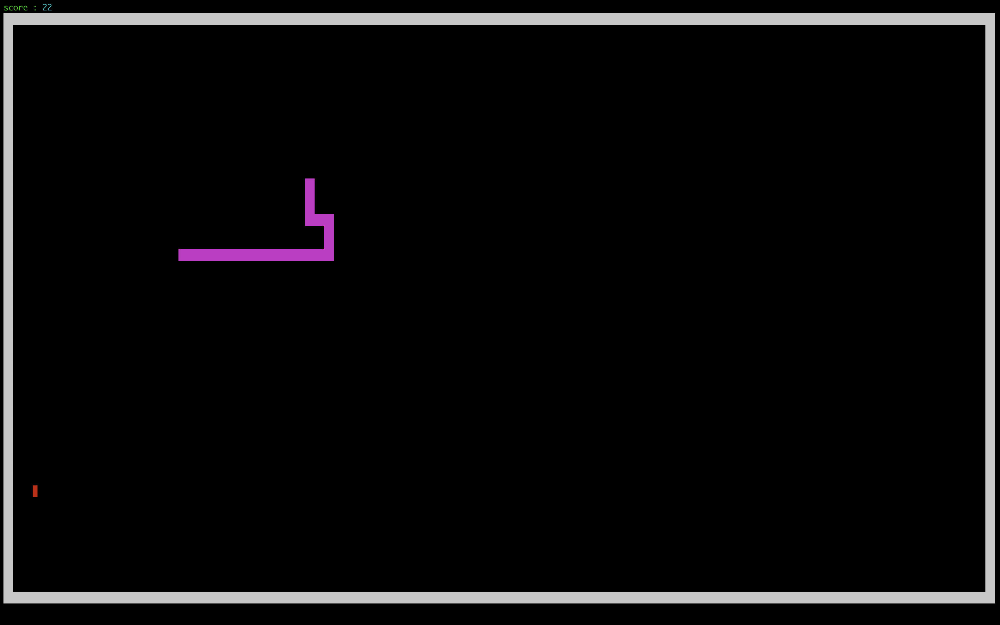

# TUI-snake

Ce mini projet reprend le jeu du snake dans une N-ieme version avec un affichage qui se fait sur le terminal.





```bash
$ git clone https://github.com/yanistvg/TUI-snake.git
$ cd TUI-snake
$ make
gcc -Wall -Wextra -Wconversion -c main.c
gcc -Wall -Wextra -Wconversion -c libs/srcs/terminal-interact.c
gcc -Wall -Wextra -Wconversion -c libs/srcs/draws.c
gcc -Wall -Wextra -Wconversion -c libs/srcs/snake.c
gcc -Wall -Wextra -Wconversion -c libs/srcs/apple.c
gcc -Wall -Wextra -Wconversion -o TUI-snake main.o terminal-interact.o draws.o snake.o apple.o
$ ./TUI-snake
```

Le programme a besoin d'une taille minimal du terminal qui doit être au moins de `86x36` caractères.